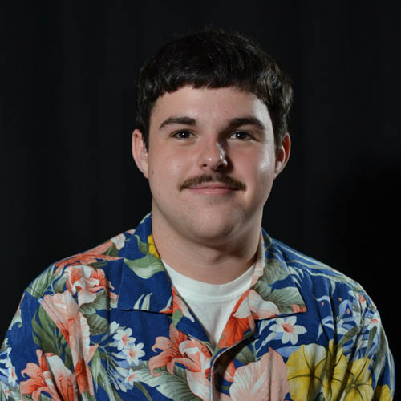

# Max Van Fleet
---

\\
I'm a junior at UNC-Chapel Hill pursuing a B.S. in applied mathematics and data science through the School of Data Science and Society and a minor in business administration at Kenan Flagler Business School. Throughout the school year, I work part-time for ResNET, which provides ITS support for Carolina Housing Students and audio-visual support for events across campus. In my free time, I love volunteering and leading expeditions with UNC APPLES, and most semesters, I volunteer as a ULA in the Math department. I'm interested in control theory, stochastic modeling, machine learning, and mathematical finance.
